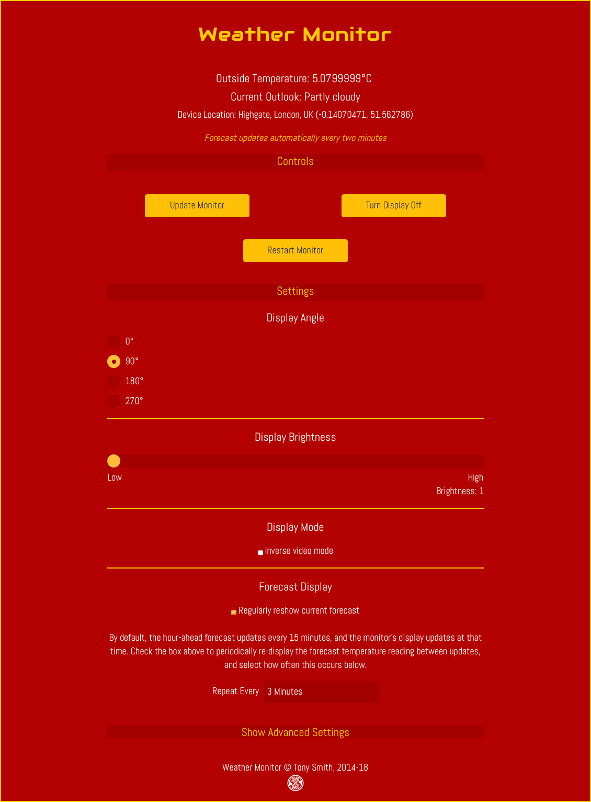

# Weather 3.9 #

Simple 8x8 hour-ahead weather forecast gadget based on the Electric Imp Platform.

## Hardware ##

### Ingredients ###

- 1x [Electric Imp Developer Kit](https://developer.electricimp.com/gettingstarted/devkits/)
- 1x [Adafruit 1.2in 8x8 LED Matrix + I&sup2;C Backpack](https://www.adafruit.com/products/1856)
- 4x short female-to-female connector wires

### Assembly ###

1. Assemble the Adafruit display and backpack
1. Solder connector pins to the Electric Imp April breakout board. I used right-angle pins so that the connectors are parallel to the breakout board.
1. Slot the imp001 card into the breakout board
1. Use the connector wires as per the table below

| April Pin | Matrix Pin |
| --- | --- |
| GND | - |
| 3V3 | + |
| Pin8 | SCL |
| Pin9 | SDA |

### Setup ###

1. Visit [Electric Imp](https://impcentral.electricimp.com/login/) to sign up for a free developer account. You will be asked to confirm your email address.
2. Visit Electric Imp’s [Getting Started Guide](https://developer.electricimp.com/gettingstarted/blinkup) to learn how to configure your imp001 to access your local WiFi network, and how to enter code into the IDE and run it on your device.
3. Visit Google’s [geolocation API site](https://developers.google.com/maps/documentation/geolocation/intro) to obtain an API key. This is used to calculate your Weather unit’s physical location.
4. Get a Dark Sky API Key, which you can obtain [here](https://darksky.net/dev/register). The Dark Sky API is a commercial service, but the first 1000 API calls made under your API key each day are free of charge. However, subsequent calls are billed at a rate of $0.0001 per call. The code posts a tally to the device log, and you can make use of its IFTTT integration to receive an email if your device is getting close to the limit.
5. Get an IFTTT account, which you can obtain [here](https://ifttt.com/). Weather instantiates an instance of Electric Imp’s [IFTTT library](https://developer.electricimp.com/libraries/webservices/ifttt) in order to post a notification to IFFTT when your Dark Sky call tally approaches the limit of daily free calls (950 out of 1000). At IFTTT, create an applet that responds to the event `"darksky_warning"` by sending an email. The current tally and the maximum allowed are sent as the *value1*, *value2* and *value3* which the applet’s email action adds to the body of the email. The applet follows the path:

    `If maker Event "darksky_warning", then send me an email at <your registered email address>`
6. Add these API keys to the agent code in the appropriate section.
7. Cut and paste the [Location library](https://github.com/smittytone/Location) code into both the agent and the device code &mdash; paste to replace the appropriate `#import` statement.
8. Cut and paste the [HT16K33Matrix library](https://github.com/smittytone/HT16K33Matrix) code into the device code &mdash; paste to replace the appropriate #import statement.

If you are using the macOS tool Squinter (download [here](https://smittytone.github.io/squinter/index.html)) to manage your Electric Imp projects, the device code is set up to import and pre-process these files. You may need to change the `#import` statements to reflect the location of the libraries on your machine. Alternatively, you can simply paste in the contents of each file over the respective `#import` statement.

## Control UI ##

The Weather Monitor has its own, web-based control UI, accessed at the agent URL.

## Release Notes ##

- 3.9 *unreleased*
  - Add [DisconnectionManager 1.1.0](https://github.com/smittytone/generic/blob/master/disconnect.nut)
- 3.8 *June 8, 2018*
    - Update to [Bootstrap 4.1.1](https://getbootstrap.com/)
        - Update Web UI based on Bootstrap
        - Separate out Web UI into own file for clarity
    - Add support for [Location class 1.5.0](https://github.com/smittytone/Location)
    - Add support for [serial logging](https://github.com/smittytone/generic/blob/master/seriallog.nut)
    - Update to [JQuery 3.3.1](https://jquery.com)
    - Prevent Ajax XHR cacheing
    - Add preliminary support for polite deployment
- 3.7
    - Add support for [Location class 1.4.1](https://github.com/smittytone/Location)
    - Assorted code tweaks, minor bug fixes made
- 3.6
    - Add support for [Location class 1.3.0](https://github.com/smittytone/Location)
    - Add icon for light rain (drizzle)
    - Nominate generic fonts for web UI in case web fonts can't be loaded
    - Adjust web UI
    - Add release notes to Read Me
    - Assorted typos fixed and tweaks made

## Licence ##

The Weather design and software is copyright &copy; 2014-18 Tony Smith and made available under the [MIT Licence](./LICENSE).
