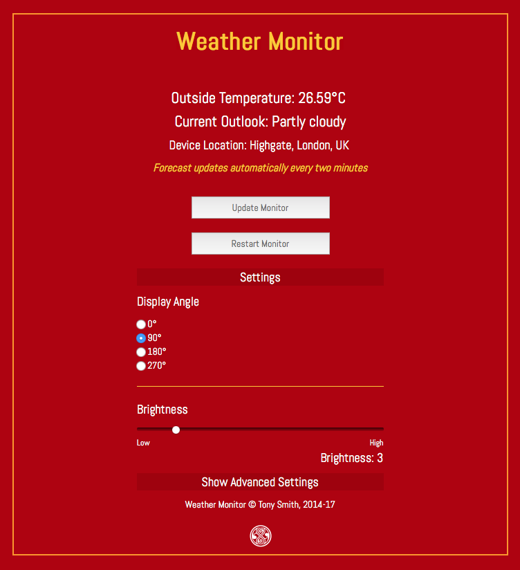

# Weather 3.3

Simple 8x8 hour-ahead weather forecast gadget based on the Electric Imp Platform.

## Hardware

### Ingredients

- 1x [Electric Imp Developer Kit](https://electricimp.com/docs/gettingstarted/devkits/)
- 1x [Adafruit 1.2in 8x8 LED Matrix + I&sup2;C Backpack](https://www.adafruit.com/products/1856)
- 4x short female-to-female connector wires

### Assembly

1. Assemble the Adafruit display and backpack
1. Solder connector pins to the Electric Imp April breakout board. Use right-angle pins so that the connectors are parallel to the breakout board.
1. Slot the imp001 card into the breakout board
1. Use the connector wires as per the table below

| April Pin | Matrix Pin |
| --- | --- |
| GND | - |
| 3V3 | + |
| Pin8 | SCL |
| Pin9 | SDA |

### Setup

1. Visit [Electric Imp](https://ide.electricimp.com/login/) to sign up for a free developer account. You will be asked to confirm your email address.
2. Visit Electric Imp’s [Getting Started Guide](https://electricimp.com/docs/gettingstarted/blinkup/) to learn how to configure your imp001 to access your local WiFi network, and how to enter code into the IDE and run it on your device.
3. Visit Electric Imp’s [Build API Guide](https://electricimp.com/docs/buildapi/) to get your Build API Key if you wish to make use of Weather’s optional Build API integration using the Electric Imp [Build API Agent library](https://electricimp.com/docs/libraries/utilities/buildapiagent/).
4. Visit Google’s [geolocation API site](https://developers.google.com/maps/documentation/geolocation/intro) to obtain your own API key. This is used to calculate your Weather unit’s physical location.
5. Get a Dark Sky API Key, which you can obtain [here](https://darksky.net/dev/register). The Dark Sky API is a commercial service. Though the first 1000 API calls made under your API key each day are free of charge, subsequent calls are billed at a rate of $0.0001 per call. You and your application will not be notified by the library if this occurs, so you may wish to add suitable call-counting code to your application.
6. Add these API keys to the agent code in the appropriate section.
7. Cut and past the [Location library](https://github.com/smittytone/Location) code into both the agent and the device code.

## Control

The Weather Monitor has its own, web-based control UI, accessed at the agent URL.

## Licence

The Weather design and software is copyright 2014-17 Tony Smith and made available under the [MIT Licence](./LICENSE).
